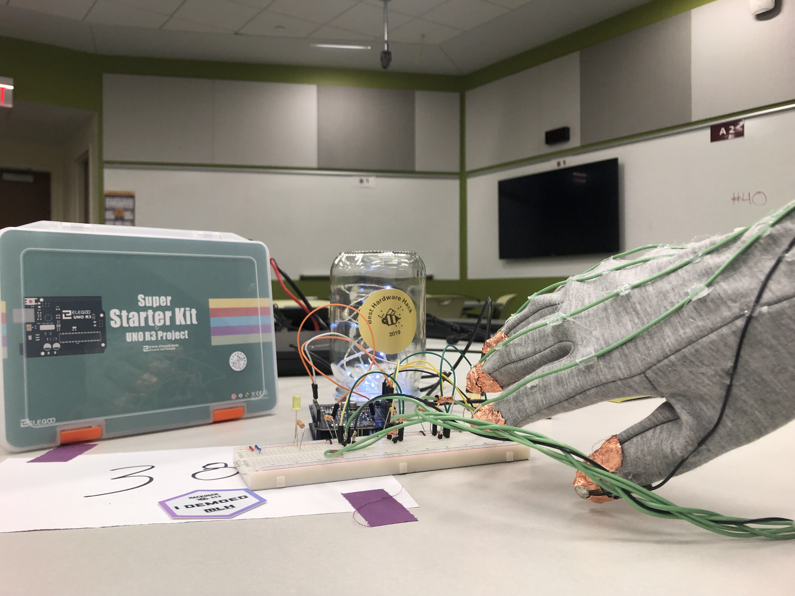
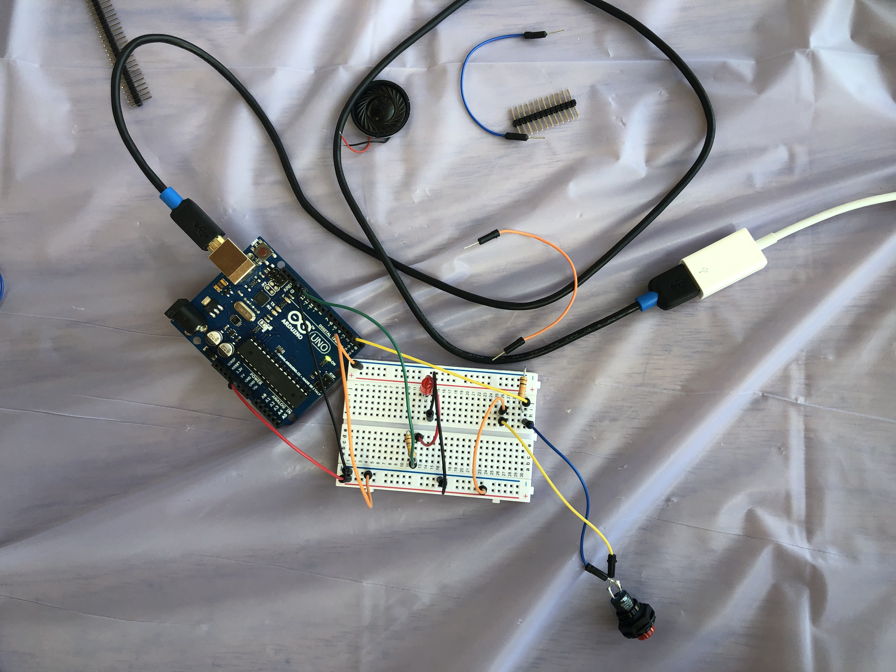

## Hack(h)er 2019 Best Hardware Hack: Musical Glove

## Description

A musical glove that plays different notes based on which finger you combine with your thumb. The aluminium foil on the tip of each finger detects when a connection (or circuit) is created. Coded in arduino, the user can determine what instrument and which four notes to play.

## Credits

I collaborated with Hannah Lerner and Sam Rydzewski.

